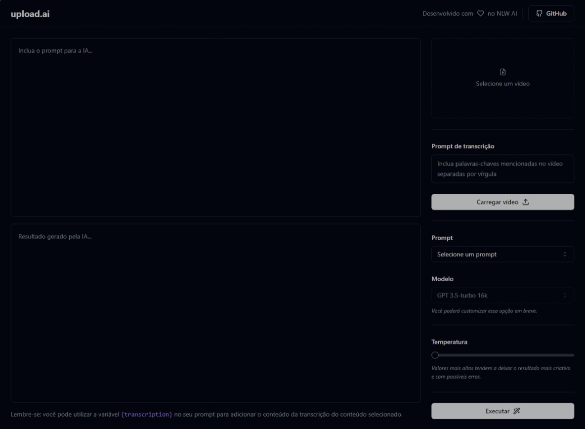

# Upload.ai - Transcrição de Vídeo com IA



Este é um projeto chamado "upload.ai" que utiliza inteligência artificial para gerar transcrições de vídeos automaticamente. Com ele, você pode fazer o upload de um vídeo e obter uma transcrição precisa em questão de segundos.

## Tecnologias Utilizadas

- **Langchain**: Plataforma de processamento de linguagem natural para melhorar a precisão da transcrição.
- **React**: Biblioteca JavaScript para a construção da interface do usuário.
- **Next.js**: Framework React para desenvolvimento web.
- **Node.js**: Ambiente de tempo de execução JavaScript para o servidor.
- **OpenAI**: API de inteligência artificial para reconhecimento de fala e processamento de texto.
- **Tailwind CSS**: Framework CSS para estilização rápida e responsiva.
- **TypeScript**: Linguagem de programação que adiciona tipagem estática ao JavaScript.
- **Vercel AI SDK**: SDK para integração com os serviços de IA da Vercel.

## Como Usar

1. Clone este repositório:

```bash
git clone https://github.com/murilonicemento/upload.ai.git
cd upload.ai
```

2. Instale as dependências:

```bash
npm install
```

3. Configure as variáveis de ambiente necessárias para as APIs (OpenAI e Vercel AI SDK) em um arquivo .env.

4. Inicie o servidor local:

```bash
npm run dev
```

5. Acesse a aplicação em seu navegador em http://localhost:5137.

6. Faça o upload de seu vídeo e aguarde a transcrição gerada pela IA.

## Contribuição

Sinta-se à vontade para contribuir com este projeto. Se encontrar problemas ou desejar adicionar recursos, crie uma issue ou envie um pull request.

## Licença

Este projeto está sob a Licença MIT. Consulte o arquivo [LICENSE](./LICENSE) para obter mais detalhes.
